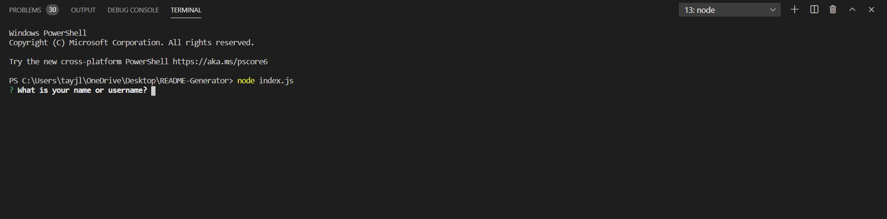

# Professional README Generator 

# Table of Contents:
* [Title](#Title)
* [Description](#Description)
* [Usage](#Usage)
* [Installation](#Installation)
* [Contribution](#Contribution)
* [Tests](#Tests)
* [License](#License)
* [Github](#Github)
* [Email](#Email)

## Description:
From the perspective of an upcoming developer, I wanted to create a README generator so that I can
quickly create professional looking README for new projects. 

## Usage:
This project uses node and npm. 

## Contribution Guidelines:
Can work from this project. If you want to add submit a pull request or open an issue. 

## Tests
Some of the tests that I ran for this project include: testing all of the options and making sure each question is prompted and the answers are returned.

## Link to Deployed Application/Github repository 
https://github.com/tjl2125/README-Generator

## Link to Demo Video/Screenshots 

Demo Video: https://drive.google.com/file/d1eQX_6TIIGrk0HRlCcVagISKPmSiK5NQx/view

## License
This project is under the MIT License
MIT License
Copyright (c) 2021 Taylor Leong
Permission is hereby granted, free of charge, to any person obtaining a copy
of this software and associated documentation files (the "Software"), to deal
in the Software without restriction, including without limitation the rights
to use, copy, modify, merge, publish, distribute, sublicense, and/or sell
copies of the Software, and to permit persons to whom the Software is
furnished to do so, subject to the following conditions:

The above copyright notice and this permission notice shall be included in all
copies or substantial portions of the Software.

THE SOFTWARE IS PROVIDED "AS IS", WITHOUT WARRANTY OF ANY KIND, EXPRESS OR
IMPLIED, INCLUDING BUT NOT LIMITED TO THE WARRANTIES OF MERCHANTABILITY,
FITNESS FOR A PARTICULAR PURPOSE AND NONINFRINGEMENT. IN NO EVENT SHALL THE
AUTHORS OR COPYRIGHT HOLDERS BE LIABLE FOR ANY CLAIM, DAMAGES OR OTHER
LIABILITY, WHETHER IN AN ACTION OF CONTRACT, TORT OR OTHERWISE, ARISING FROM,
OUT OF OR IN CONNECTION WITH THE SOFTWARE OR THE USE OR OTHER DEALINGS IN THE
SOFTWARE.

# Questions
## Github
Here is my profile: https://github.com/tjl2125 if you want to see more of my work.

## Email
Here is my email: tjl2125@alum.barnard.edu. Feel free to reach me here.`;